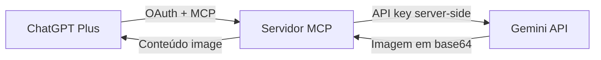

# Arquitetura final — Gemini Ads MCP

## Decisão

O produto é um servidor MCP privado, sem interface própria de geração. O ChatGPT é a interface conversacional e chama a ferramenta `generate_ad`. O servidor valida a chamada, monta o briefing técnico, chama a API de imagens do Gemini e devolve a imagem como conteúdo MCP.

## Componentes

| Componente | Responsabilidade |
| --- | --- |
| ChatGPT Developer Mode | Interpretar o pedido e chamar `generate_ad` |
| MCP Streamable HTTP | Contrato portátil entre o ChatGPT e o backend |
| OAuth privado | Impedir que terceiros consumam a cota Gemini |
| Núcleo Gemini | Construir prompt, chamar o modelo e validar a imagem |
| Vercel | Executar o backend e proteger variáveis de ambiente |
| GitHub | Versionar código, documentação e testes |

## Segurança

- `GEMINI_API_KEY` existe apenas como variável server-side.
- Nenhuma variável secreta usa prefixo `NEXT_PUBLIC_`.
- A chave Gemini é enviada no header `x-goog-api-key`, nunca em URL ou resultado MCP.
- O endpoint `/mcp` exige access token OAuth com escopo `generate:ads`.
- O servidor aceita somente o cliente OAuth privado configurado por ambiente.
- Inputs têm tamanho limitado e são validados por schema.
- O tool call é marcado como ação externa não destrutiva porque consome cota paga.

## Portabilidade

- O handler usa `Request`/`Response` Web Standard.
- O protocolo é MCP Streamable HTTP, sem APIs proprietárias do ChatGPT.
- A integração Gemini usa `fetch`, não depende de SDK hospedado.
- Configuração vive em variáveis de ambiente.
- A Vercel pode ser substituída por qualquer host Node 20+ compatível com Fetch.

## Limites conscientes do v1

- Uma imagem por chamada para evitar timeout e exceder o limite de resposta inline.
- Imagem retorna diretamente ao ChatGPT e não é persistida.
- Logos e imagens de referência ainda não entram no prompt multimodal.
- Revisão ortográfica continua necessária porque texto gerado dentro de imagem pode variar.

## Evolução após o primeiro teste

1. Armazenamento de imagens em Blob/S3 com URLs persistentes.
2. `generate_ads` em lote com concorrência controlada e idempotência.
3. Upload de logo, brand kit e imagens de referência.
4. Variações por formato e ângulo.
5. Histórico de gerações, custo, modelo e prompt.
6. Fila assíncrona para lotes maiores.
